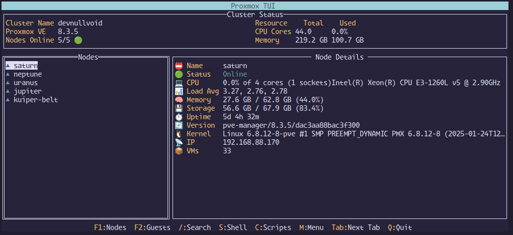
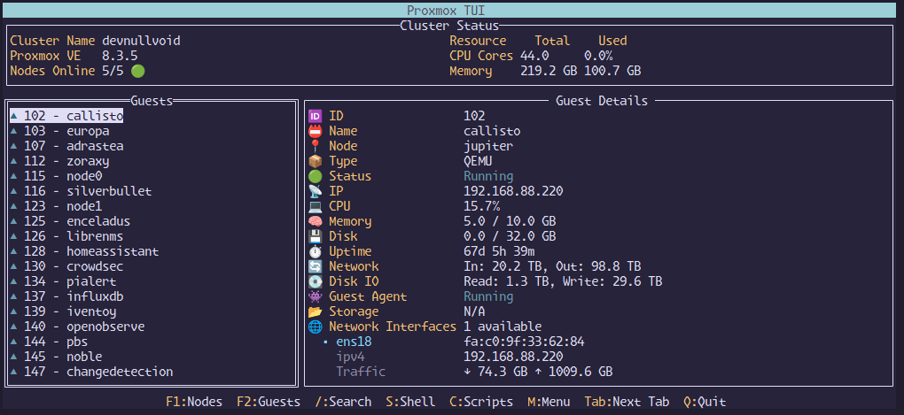

<p align="center">
  
</p>

<h1 align="center">Proxmox TUI</h1>
<p align="center">
  <strong>A powerful Terminal User Interface for Proxmox VE clusters</strong>
</p>

<p align="center">
  <a href="#features">Features</a> •
  <a href="#screenshots">Screenshots</a> •
  <a href="#installation">Installation</a> •
  <a href="#configuration">Configuration</a> •
  <a href="#authentication">Authentication</a> •
  <a href="#usage">Usage</a>
</p>


## 🚀 Overview

Proxmox TUI brings lightning-fast cluster management directly to your terminal. Built with Go, it combines CLI speed with GUI-like navigation.

**Key Features:**
- 🚀 **Fast**: Intelligent caching for responsive performance
- 🖥️ **Complete Management**: VMs, containers, nodes, and resources
- 🔐 **Secure**: API token or password authentication
- 🐚 **Integrated Shells**: SSH directly to nodes, VMs, and containers
- 🖱️ **VNC Support**: Browser-based console access
- 📜 **Community Scripts**: Install Proxmox community scripts directly

## 📸 Screenshots

<p align="center">
  <br>
  <em>Node Management View - Detailed node information and status</em>
</p>

<p align="center">
  <br>
  <em>Guest Management View - Real-time monitoring of VMs and containers</em>
</p>

## 🔧 Requirements

- Go (version 1.20 or later recommended)
- Access to a Proxmox VE cluster
- SSH access to nodes/guests (for shell functionality)

## 📦 Installation

### From Source

```bash
# Clone the repository
git clone https://github.com/devnullvoid/proxmox-tui.git
cd proxmox-tui

# Build the application
go build -o proxmox-tui ./cmd/proxmox-tui

# Copy example config
cp configs/config.yml.example config.yml

# Edit with your Proxmox details
$EDITOR config.yml

# Run the application
./proxmox-tui -config config.yml
```

### Pre-compiled Binaries

Pre-compiled binaries for various platforms are available on the [Releases page](https://github.com/devnullvoid/proxmox-tui/releases).

#### Download and Install

1. Go to the [Releases page](https://github.com/devnullvoid/proxmox-tui/releases)
2. Download the appropriate binary for your platform:
   - **Linux AMD64**: `proxmox-tui-linux-amd64.tar.gz`
   - **Linux ARM64**: `proxmox-tui-linux-arm64.tar.gz`
   - **macOS Intel**: `proxmox-tui-darwin-amd64.tar.gz`
   - **macOS Apple Silicon**: `proxmox-tui-darwin-arm64.tar.gz`
   - **Windows**: `proxmox-tui-windows-amd64.zip`
3. Extract the archive:
   ```bash
   # For Linux/macOS
   tar -xzf proxmox-tui-*.tar.gz
   
   # For Windows
   # Extract using your preferred zip tool
   ```
4. Make executable (Linux/macOS only):
   ```bash
   chmod +x proxmox-tui-*
   ```
5. Run the application:
   ```bash
   ./proxmox-tui-* -config /path/to/your/config.yml
   ```

## ⚙️ Configuration

Proxmox TUI offers flexible configuration through YAML files, environment variables, and command-line flags. Configuration follows this precedence order (highest to lowest):

1. Command-line flags
2. Configuration file
3. Environment variables

### XDG Base Directory Compliance

Proxmox TUI follows the [XDG Base Directory Specification](https://specifications.freedesktop.org/basedir-spec/basedir-spec-latest.html) for configuration and cache files:

- **Config file**: `$XDG_CONFIG_HOME/proxmox-tui/config.yml` (defaults to `~/.config/proxmox-tui/config.yml`)
- **Cache directory**: `$XDG_CACHE_HOME/proxmox-tui` (defaults to `~/.cache/proxmox-tui`)
- **Log files**: Stored in the cache directory as `proxmox-tui.log`

If no config file is specified via the `-config` flag, the application will automatically look for and load the default XDG config file if it exists.

### Configuration File

Create a `config.yml` file in the default location (`~/.config/proxmox-tui/config.yml`) or specify a custom path with your Proxmox connection details:

```yaml
# Basic connection settings
addr: "https://your-proxmox-host:8006"
insecure: false  # Set to true to skip TLS verification (not recommended for production)

# Authentication (choose one method)
user: "your-api-user"
realm: "pam"

# Method 1: Password authentication
password: "your-password"

# Method 2: API Token authentication (recommended)
token_id: "your-token-id"
token_secret: "xxxxxxxx-xxxx-xxxx-xxxx-xxxxxxxxxxxx"

# Additional settings
ssh_user: "your-ssh-user"
debug: false
# cache_dir: "/custom/cache/path"  # Optional: defaults to ~/.cache/proxmox-tui
```

## 🔐 Authentication

Proxmox TUI supports two authentication methods:

### Username/Password Authentication

Uses Proxmox's ticket-based authentication with automatic renewal every 2 hours. Simple to set up but requires storing your password.

### API Token Authentication (Recommended)

Uses Proxmox API tokens for enhanced security with these benefits:
- No expiration (unless manually revoked)
- Granular permission control
- Better for automation and long-running sessions
- More secure than password-based authentication

#### Creating API Tokens in Proxmox

1. Log into your Proxmox web interface
2. Navigate to **Datacenter → Permissions → API Tokens**
3. Click **Add** to create a new token
4. Set the **User** (e.g., `root@pam`)
5. Enter a **Token ID** (e.g., `proxmox-tui`)
6. Decide whether to check **Privilege Separation** (unchecked gives the token the same permissions as the user)
7. Click **Create**
8. **Important**: Copy both the **Token ID** and **Secret** as the secret will only be shown once

## 🖥️ Usage

Run Proxmox TUI with your configuration file:

```bash
# Using explicit config file path
./proxmox-tui -config /path/to/your/config.yml

# Or place config.yml in ~/.config/proxmox-tui/ and run without -config flag
./proxmox-tui
```

### Keyboard Navigation

- **F1**: View Nodes
- **F2**: View Guests
- **/**: Search/Filter
- **S**: Open Shell
- **V**: Open VNC Console
- **C**: View Community Scripts
- **M**: Open Menu
- **Tab/Next Tab**: Switch between tabs
- **Q**: Quit

## 🤝 Contributing

Contributions are welcome! Feel free to submit issues or pull requests.

## 📄 License

This project is licensed under the MIT License - see the LICENSE file for details.
