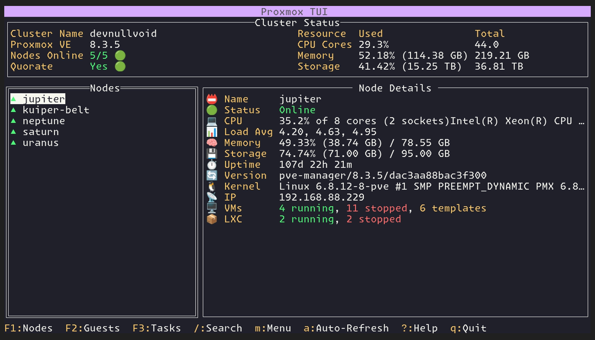
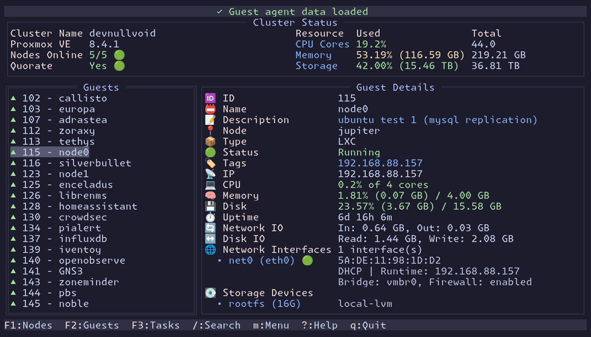

<h1 align="center">pvetui</h1>
<p align="center">
  <strong>A Terminal User Interface For Proxmox Virtual Environment</strong>
</p>

<p align="center">
  <a href="#-features">Features</a> •
  <a href="#-screenshots">Screenshots</a> •
  <a href="#-installation">Installation</a> •
  <a href="#-configuration">Configuration</a> •
  <a href="#-usage">Usage</a> •
  <a href="#-theming">Theming</a> •
  <a href="#-vnc-console-access">VNC Console</a>
</p>

<!-- Badges -->
<p align="center">
  
  
  
  
  
  <a href="https://deepwiki.com/devnullvoid/pvetui"></a>
</p>

<!-- Demo Video -->
https://github.com/user-attachments/assets/c8e1183a-7204-47ac-9a15-e39ba8e275ef

## 🚀 Features

- **Lightning Fast**: Intelligent caching for responsive performance
- **Complete Management**: VMs, containers, nodes, and cluster resources
- **Multi-Profile Support**: Manage multiple Proxmox connections with profile switching
- **Automatic Migration**: Legacy configs seamlessly migrate to modern profile-based format
- **Secure Authentication**: API tokens or password-based auth with automatic renewal
- **Integrated Shells**: SSH directly to nodes, VMs, and containers
- **VNC Console Access**: Embedded noVNC client with automatic authentication
- **Plugin System**: Opt-in extensions including the Community Scripts installer; enable via Manage Plugins dialog or config file
- **Modern Interface**: Vim-style navigation with customizable key bindings
- **Flexible Theming**: Automatic adaptation to terminal emulator color schemes
- **Comprehensive Documentation**: Detailed guides for configuration, theming, and development

## 📸 Screenshots

<p align="center">
  <br>
  <em>Node Management - Real-time cluster monitoring and control</em>
</p>

<p align="center">
  <br>
  <em>Guest Management - VM and container operations</em>
</p>

**📸 See [docs/SCREENSHOTS.md](docs/SCREENSHOTS.md) for a complete showcase of all available screenshots and interface features**

## 📦 Installation

### Quick Start

### **Install via Go** (Go 1.24+)

> **Recommended for Go users**: pvetui now supports one-command install using Go modules!

```bash
go install github.com/devnullvoid/pvetui/cmd/pvetui@latest
```

**From Pre-compiled Binaries:**
1. Download from [Releases](https://github.com/devnullvoid/pvetui/releases)
2. Extract and run: `./pvetui`

> **macOS Users**: You may encounter Gatekeeper warnings with pre-compiled binaries. See [Troubleshooting Guide](docs/TROUBLESHOOTING.md#-macos-issues) for solutions including bypassing the warning or building from source.

### Package Managers

**Arch Linux (AUR):**
[](https://aur.archlinux.org/packages/pvetui-git/)
[](https://aur.archlinux.org/packages/pvetui/)
[](https://aur.archlinux.org/packages/pvetui-git/)
```bash
# Binary package (recommended)
yay -S pvetui-bin

# Build release package from source
yay -S pvetui

# OR build from source
yay -S pvetui-git
```

**macOS (Homebrew Cask):**
```bash
# Install directly from the tap (brew will auto-clone devnullvoid/homebrew-pvetui)
brew install --cask devnullvoid/pvetui/pvetui
```

**Windows (Scoop):**
```bash
# Add the bucket
scoop bucket add pvetui https://github.com/devnullvoid/scoop-pvetui

# Install pvetui
scoop install pvetui
```

**From Source:**
```bash
git clone https://github.com/devnullvoid/pvetui.git
cd pvetui
make install  # Build and install from source
# or: make install-go  # Install via Go toolchain
```


## 🔧 Configuration

### First Run & Interactive Config Wizard
- On first run, the app will offer to create and edit a config file in a user-friendly TUI wizard
- Launch the wizard anytime with `--config-wizard`
- Create and manage multiple connection profiles with validation
- Edit, validate, and save your config (supports SOPS-encrypted files)
- Only one authentication method (password or token) per profile is allowed
- All errors and confirmations are shown in clear, interactive modals

### Configuration Format

pvetui uses a modern multi-profile configuration format that supports multiple Proxmox connections:

```yaml
profiles:
  default:
    addr: "https://your-proxmox-host:8006"
    user: "your-user"
    realm: "pam"
    # Choose one authentication method:
    password: "your-password"           # Method 1: Password auth
    # OR
    token_id: "your-token-id"          # Method 2: API token (recommended)
    token_secret: "your-secret"
    insecure: false
    ssh_user: "your-ssh-user"

  work:
    addr: "https://work-proxmox:8006"
    user: "workuser"
    token_id: "worktoken"
    token_secret: "worksecret"
    realm: "pam"
    insecure: false
    ssh_user: "workuser"

default_profile: "default"
debug: false
```

### Plugins

pvetui includes an opt-in plugin system for optional features. Plugins are **disabled by default** and must be explicitly enabled.

#### Built-in Plugins

- **`community-scripts`**: Adds the popular Community Scripts installer to node context menus
- **`command-runner`**: Execute whitelisted commands on Proxmox hosts via SSH (requires SSH key setup)
- **`demo-guest-list`**: Example plugin showing running guests (for reference/testing)

#### Enabling Plugins

**Method 1: Manage Plugins Dialog (Recommended)**

1. Press `g` to open the Global Menu
2. Select **Manage Plugins**
3. Use arrow keys or `j`/`k` to navigate the plugin list
4. Press `Space` to toggle plugins on/off
5. Press `Enter` to save changes
6. Restart pvetui for changes to take effect

**Method 2: Configuration File**

Add plugin IDs to your config file:

```yaml
plugins:
  enabled:
    - "community-scripts"
    - "command-runner"
    - "demo-guest-list"
```

**📖 For plugin development and advanced details, see [docs/PLUGINS.md](docs/PLUGINS.md)**

### Profile Management

The built-in profile manager allows you to:
- **Switch between profiles** (e.g., home, work, development)
- **Add new profiles** with different Proxmox connections
- **Edit existing profiles** with validation
- **Delete profiles** with confirmation
- **Set default profile** for automatic connection

Access the profile manager through the global menu.

### API Token Setup (Recommended)
1. In Proxmox web interface: **Datacenter → Permissions → API Tokens**
2. Click **Add** → Set user (e.g., `root`) → Enter token ID
3. Copy the generated **Token ID** and **Secret** to your config

> Note: Proxmox displays the Token ID in the form `user@realm!tokenid` (for example: `root@pam!mytoken`). When configuring pvetui, split those parts into separate fields:

```yaml
profiles:
  default:
    addr: "https://your-proxmox-host:8006"
    user: "root"          # from user@realm!tokenid → user
    realm: "pam"          # from user@realm!tokenid → realm
    token_id: "mytoken"   # from user@realm!tokenid → tokenid
    token_secret: "YOUR_SECRET"
```

### Encrypted Configuration
Supports [SOPS](https://github.com/getsops/sops) encrypted config files. Point to an encrypted YAML file with `--config` and it will decrypt automatically.

Not using SOPS yet? pvetui now auto-detects cleartext `password` and `token_secret` values in plain YAML configs and rewrites the file with encrypted blobs (while updating the running config) as soon as you connect successfully. That keeps legacy configs safe without forcing you to adopt a new workflow.

**📖 For detailed configuration options, key bindings, theming, and advanced features, see [docs/CONFIGURATION.md](docs/CONFIGURATION.md)**

**📚 Complete documentation is available in the [docs/](docs/) folder**

## 🔌 Usage

```bash
# Auto-detects config at ~/.config/pvetui/config.yml
./pvetui

# Or specify custom config
./pvetui --config /path/to/config.yml
```

### Command Line Options

| Flag | Short | Description |
|------|-------|-------------|
| `--config` | `-c` | Path to YAML config file |
| `--profile` | `-p` | Connection profile to use (overrides default_profile) |
| `--no-cache` | `-n` | Disable caching |
| `--version` | `-v` | Show version information |
| `--config-wizard` | `-w` | Launch interactive config wizard and exit |
| `--addr` | | Proxmox API URL |
| `--user` | | Proxmox username |
| `--password` | | Proxmox password |
| `--token-id` | | Proxmox API token ID |
| `--token-secret` | | Proxmox API token secret |
| `--realm` | | Proxmox realm |
| `--insecure` | | Skip TLS verification |
| `--api-path` | | Proxmox API path |
| `--ssh-user` | | SSH username |
| `--debug` | | Enable debug logging |
| `--cache-dir` | | Cache directory path |

**Environment Variables**: All flags can also be set via environment variables with `PVETUI_` prefix (e.g., `PVETUI_ADDR`, `PVETUI_USER`).

### Key Bindings

| Key | Action | Key | Action |
|-----|--------|-----|--------|
| `h j k l` | Navigate | `Alt+1/2/3` | Switch views |
| `Enter` | Select | `[ ]` | Previous/Next view |
| `s` | SSH Shell | `v` | VNC Console |
| `m` | Context Menu | `g` | Global Menu |
| `/` | Search | `a` | Auto-refresh |
| `?` | Help | `q` | Quit |

Customize keys via the `key_bindings` section in your config. See [docs/CONFIGURATION.md#key-bindings](docs/CONFIGURATION.md#key-bindings) for all options (including macOS `Opt` key support).

## 🎨 Theming

pvetui supports semantic theming with automatic adaptation to your terminal's color scheme.

**📖 For detailed theming options, built-in themes, and color customization, see [docs/CONFIGURATION.md#theming](docs/CONFIGURATION.md#theming) and [docs/THEMING.md](docs/THEMING.md)**

## 📺 VNC Console Access

Built-in noVNC client provides seamless console access:
- **Zero Configuration**: Works out of the box
- **Automatic Authentication**: No separate login required
- **Universal Support**: VMs, containers, and node shells
- **Secure Proxy**: Local WebSocket proxy handles connections

**Note**: Node VNC shells require password authentication (Proxmox limitation).

**Important**: VNC ports must be opened and accessible on the connected Proxmox server. The TUI creates a local WebSocket proxy that connects to the Proxmox VNC endpoint, so ensure your Proxmox server's VNC ports are properly configured and accessible from your client machine.

<!-- Consolidated into Usage → Key Bindings -->

## 🔧 Requirements

- Access to Proxmox VE cluster
- SSH access for shell functionality
- Go 1.24+ (for building from source)

## 💡 Tips

- **Use SSH keys for authentication**: For best security and convenience, set up SSH key-based authentication with your Proxmox hosts. Avoid password-based SSH logins.
- **Passwordless pct access**: Add a sudoers rule on your Proxmox hosts to allow your user to run `pct enter` and `pct exec` without being prompted for a password. Example sudoers line:
  ```
  youruser ALL=(ALL) NOPASSWD: /usr/sbin/pct enter *, /usr/sbin/pct exec *
  ```

### 🛠️ Troubleshooting

Check our **[Troubleshooting Guide](docs/TROUBLESHOOTING.md)** for solutions to common problems including:

- 🍎 **macOS Gatekeeper warnings** (`zsh: killed` errors)
- 🪟 **Windows SmartScreen** and antivirus issues
- 🐧 **Linux permission** problems
- 🔧 **General installation** and configuration issues

## 🐳 Docker Usage

```bash
git clone https://github.com/devnullvoid/pvetui.git
cd pvetui
cp .env.example .env  # Edit with your Proxmox details
docker compose run --rm pvetui
```

See [docs/DOCKER.md](docs/DOCKER.md) for advanced usage.

## 🤝 Contributing

Contributions welcome! Check the [issues page](https://github.com/devnullvoid/pvetui/issues).

## 📝 License

MIT License - see [LICENSE](LICENSE) file for details.

This repository vendors assets from [noVNC](https://github.com/novnc/noVNC) under MPL-2.0, BSD, SIL OFL, MIT, and CC BY-SA licenses. Refer to [THIRD_PARTY_LICENSES.md](THIRD_PARTY_LICENSES.md) for a full breakdown and include that file plus `internal/vnc/novnc/LICENSE.txt` (and sub-licenses) with any binary release artifacts to satisfy attribution and redistribution requirements.

## ™️ Trademark Notice

**Proxmox®** is a registered trademark of Proxmox Server Solutions GmbH in the EU, the U.S., and other countries. This project is not affiliated with, endorsed by, or sponsored by Proxmox Server Solutions GmbH. "Proxmox" is used solely to describe compatibility with Proxmox Virtual Environment software.

---
### Upgrading Embedded noVNC
This repository includes the noVNC HTML/JS client under `internal/vnc/novnc` via [git subtree](https://www.atlassian.com/git/tutorials/git-subtree). To upgrade to a newer noVNC version, run:

```bash
git subtree pull --prefix=internal/vnc/novnc https://github.com/novnc/noVNC.git <tag-or-commit> --squash
```

Replace `<tag-or-commit>` with the desired version. After updating, prune unnecessary files if you only need the built assets. Commit the results to share the update with all users.
