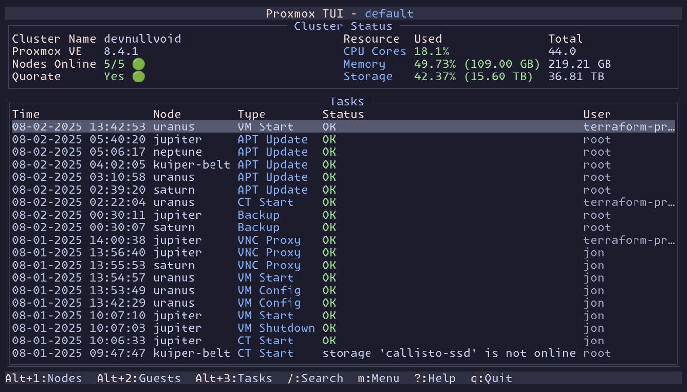
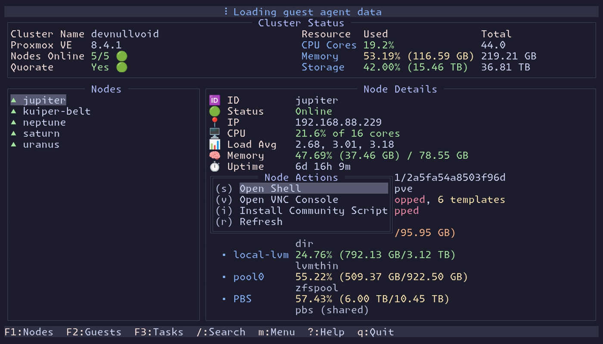
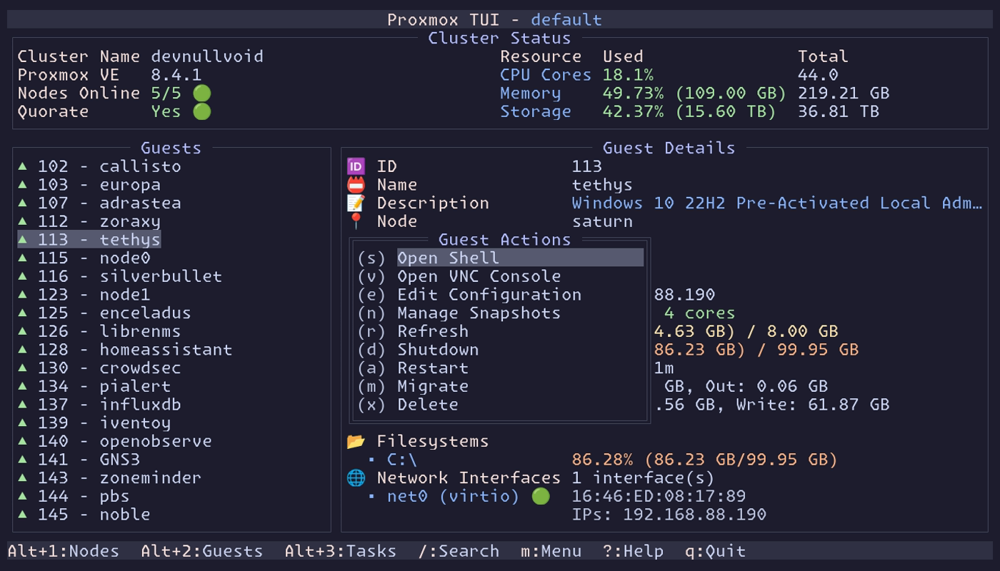
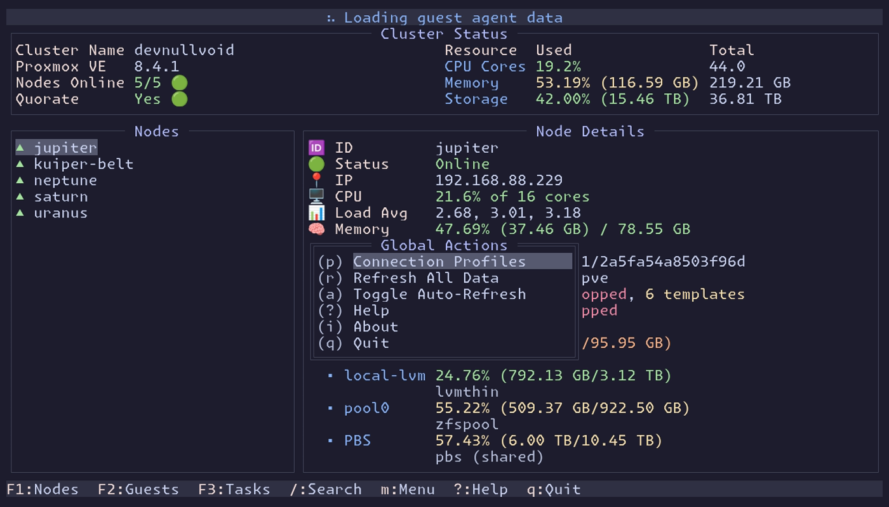

# Screenshots

This page showcases screenshots of pvetui in action, demonstrating its various features and interface elements.

## 📸 Application Screenshots

### Main Interface Views

#### Node Management

*Real-time cluster monitoring and control - View system resources, manage nodes, and monitor cluster health*

#### Guest Management

*VM and container operations - Start, stop, manage, and monitor virtual machines and containers*

#### Tasks Overview

*Task monitoring and management - Track running operations, view logs, and manage background tasks*

### Context Menus and Navigation

#### Node Context Menu

*Context menu for node operations - Quick access to node-specific actions and management options*

#### Guest Context Menu

*Context menu for VM/container operations - Manage individual guests with context-sensitive actions*

#### Global Menu

*Global application menu - Access application-wide settings, profile management, and system functions*

## 🎥 Demo Videos

### Live Demo

*Live demonstration of pvetui in action - Watch the interface respond to user interactions*

### Video Demo
[Watch Demo Video](../demo.webm) (WebM format - higher quality than GIF)
*Comprehensive video demonstration showing key features and workflows*

## 🎨 Interface Features

### Key Visual Elements

- **Color-coded Status Indicators**: Running (green), stopped (red), pending (yellow)
- **Resource Usage Bars**: Visual representation of CPU, memory, and storage usage
- **Hierarchical Navigation**: Clear organization of nodes, guests, and tasks
- **Context-sensitive Menus**: Relevant actions based on current selection
- **Real-time Updates**: Live data refresh and status monitoring

### Navigation Patterns

- **Vim-style Navigation**: `h`, `j`, `k`, `l` keys for movement
- **Tab Switching**: `Alt+1/2/3` for quick view switching
- **Context Menus**: `m` key for context-sensitive actions
- **Global Menu**: `g` key for application-wide functions
- **Search**: `/` key for filtering and finding resources

### Responsive Design

- **Adaptive Layout**: Automatically adjusts to terminal size
- **Theme Support**: Adapts to terminal color schemes
- **Accessibility**: High contrast options and clear visual hierarchy
- **Cross-platform**: Consistent experience across different terminal emulators

## 📱 Usage Examples

### Daily Operations

1. **Cluster Monitoring**: Quickly check node status and resource usage
2. **VM Management**: Start, stop, and manage virtual machines
3. **Container Operations**: Manage LXC containers and their resources
4. **Task Tracking**: Monitor background operations and their progress
5. **Quick Access**: Use context menus for common operations

### Advanced Features

- **Multi-profile Support**: Switch between different Proxmox clusters
- **SSH Integration**: Direct shell access to nodes and guests
- **VNC Console**: Embedded noVNC client for graphical access
- **Community Scripts**: Install and manage Proxmox community scripts
- **Automated Refresh**: Real-time updates with configurable intervals

## 🎯 Screenshot Details

### Technical Information

- **Resolution**: Optimized for terminal displays (typically 80x24 or larger)
- **Color Support**: Full 256-color support with theme adaptation
- **Format**: PNG for static images, GIF/WebM for animations
- **Size**: Optimized for web viewing while maintaining quality

### Accessibility

- **High Contrast**: Clear distinction between different UI elements
- **Readable Fonts**: Monospace fonts for consistent display
- **Color Blindness**: Theme options that work for color-blind users
- **Keyboard Navigation**: Full keyboard accessibility

## 🔗 Related Documentation

- **[Configuration Guide](CONFIGURATION.md)** - Learn how to customize the interface
- **[Theming Guide](THEMING.md)** - Customize colors and appearance
- **[Main README](../README.md)** - Get started with pvetui
- **[Docker Guide](DOCKER.md)** - Deploy using containers

---

*Screenshots are taken from actual pvetui sessions and represent the current interface design. The appearance may vary slightly based on your terminal emulator and theme settings.*
